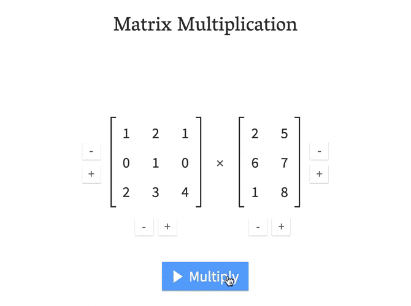

# Linear-Algebra

This repository was made during my personal preparation for the "Computer Science and Artificial Intelligence BSc (Hons)" at the university of Sussex. **Linear Algebra** being one of the **main pillars** of **machine learning** I had to get a better grasp than what I had learned in school.

Linear Algebra is a branch of mathematics that deals with linear equations and linear functions which are represented through **matrices** and **vectors**. In simpler words, LA helps you understand geometric terms such as planes, in higher dimensions, and perform mathematical operations on them. By definition, algebra deals primarily with scalars (one-dimensional entities), but LA has vectors and matrices (entities which possess two or more dimensional components) to deal with linear equations and functions.

## Vector
vectors are a combination of two values **x and y** in a 2 Dimension space.
or a combination of tree value **x ,y and z** in a 3 Dimensional space etc...

### Notation

#### Magnitude
The **Magnitude is the lenght** of a vector
**i.g** the "hypotenuse" of a triangle that a 2d Vector would form is the magnitude.

#### Unit Vector / Identity Vector
Unit vectors are vectors whose magnitude is exactly 1 unit. They are very useful for different reasons. Specifically, the unit vectors [0,1] and [1,0] can **form** together **any other vector**.

**i.e** the unit û of the vector (a,b) will be
 

basically just divide each number by the magnitude of the vector.
**i.g** the unit û of the vector (3,4) will be (⅗,⅘)

#### Scalar
A scalar is a value that will **scale** the vector by multiplying it.

### Basic Concept
#### Linear dependency
##### Linear dependent
A linearly dependent vector can be a combination of other vector of the set. simply meaning that these vector are on the same "line/direction".

**i.g** the set of vectors **[1,2] [3,2] [2,1]** is linearly dependent because we have 3 vector in two dimension and none of them are collinear or null. which means that you can already represent any point in the two dimension by using a combination of only two vector of this set.

**i.e** You can prove this mathematically by scaling each of this vector by a constant and if one of the content is not equals to zero then the set is linearly dependent.
(c1*[1,2]+c2[3,2]+c3[2,1])

[example on linearly dependence](https://www.khanacademy.org/math/linear-algebra/vectors-and-spaces/linear-independence/v/more-on-linear-independence)

##### Linear independent
A linearly independent vector **cannot be** a **combination** of other vector of the set.

**i.e** You can prove this by doing the same thing as above and if all of the constant must be equals to zero in order of the equation to be true then the set is linearly independent.
#### collinear
Two vetor that are on the same line.
**i.e** Have the same direction.
#### vector multiplication
##### Cross product

The cross product tell you how much **perpendicular** the vectors are.

[video explanation](https://www.youtube.com/watch?v=eu6i7WJeinw&t)
##### Dot product / Scalar product / Inner Product

The dot product tell you how much **parallel** the vectors are.
or the "degree of correlation" between two vectors

[video explanation](https://www.youtube.com/watch?v=LyGKycYT2v0&t)
##### normal vector

## Matrix
A matrix  is a rectangular array of numbers, symbols, or expressions, arranged in rows and columns. For example, the dimension of the matrix below is 2 × 3 (read "two by three"), because there are two rows and three columns: 

### Notation

#### Rank of a matrix
Maximum number of vector needed to represent any point in the space of the matrix
“basically number of dimension“
or more precisely the number of linearly independent vector.
[wikipedia](https://en.wikipedia.org/wiki/Rank_(linear_algebra))

#### Basis of a matrix
basis are î and ^j
[wikipedia](https://en.wikipedia.org/wiki/Basis_(linear_algebra))

#### Span of a Vector/matrix
The "**span**" of **v** and **w** is the set of **all their linear combinations**.

``av + bv``

Let a and b vary over all real number
### Method and equation
#### Matrix multiplication

#### gauss elimination
Gauss elimination is quite simple. your goal is to end up with a echelon Form by adding or substracting row between them.

[wikipedia](https://en.wikipedia.org/wiki/Gaussian_elimination)

##### Row/column echelon and reduce row echelon Form

1) Basically a matrix is in echelon form if it has the shape resulting from a Gaussian elimination. Row echelon form means that Gaussian elimination has operated on the rows

2) column echelon form means that Gaussian elimination has operated on the columns. In other words, a matrix is in column echelon form if its transpose is in row echelon form.

#### development of Laplace

1- select a line or column that has the most zero because it reduce the length of the calculus

#### Cramer rule

[wikipedia](https://en.wikipedia.org/wiki/Cramer%27s_rule)

#### Null Space
What is it ?

If A is your matrix, the null-space is simply put, the set of all vectors v such that ``A⋅v=0``. It's good to think of the matrix as a linear transformation; if you let ``h(v)=A⋅v``, then the null-space is again the set of all vectors that are sent to the zero vector by h. Think of this as the set of vectors that lose their identity as h is applied to them.
**i.g** The range of A represents the area of the room that can be illuminated. The null space of A represents the power we can apply to lamps that don't change the illumination in the room at all.

[Source](https://math.stackexchange.com/questions/21131/physical-meaning-of-the-null-space-of-a-matrix)

How to calculate the null space of a matrix.
[Khan Academy video](https://www.khanacademy.org/math/linear-algebra/vectors-and-spaces/null-column-space/v/null-space-2-calculating-the-null-space-of-a-matrix?modal=1)
#### left null space
It is the transpose of the null Space

#### column space of a matrix

[Khan Academy video](https://www.khanacademy.org/math/linear-algebra/vectors-and-spaces/null-column-space/v/visualizing-a-column-space-as-a-plane-in-r3?modal=1)

#### row space
It is the transpose of the column Space.

## Acknowledgement

A huge thank to [khanacademy](https://www.khanacademy.org/) and [3 brown 1 blue](https://www.youtube.com/channel/UCYO_jab_esuFRV4b17AJtAw/videos).
You make the education system look like an arrogant clown that isn't funny (and you pay 10k a year wasting your time everyday to hear him say that student are lazzy #salt).

I couldn't have done this without you.
A thousand thanks!

___________________________________________________________

## flashcards
